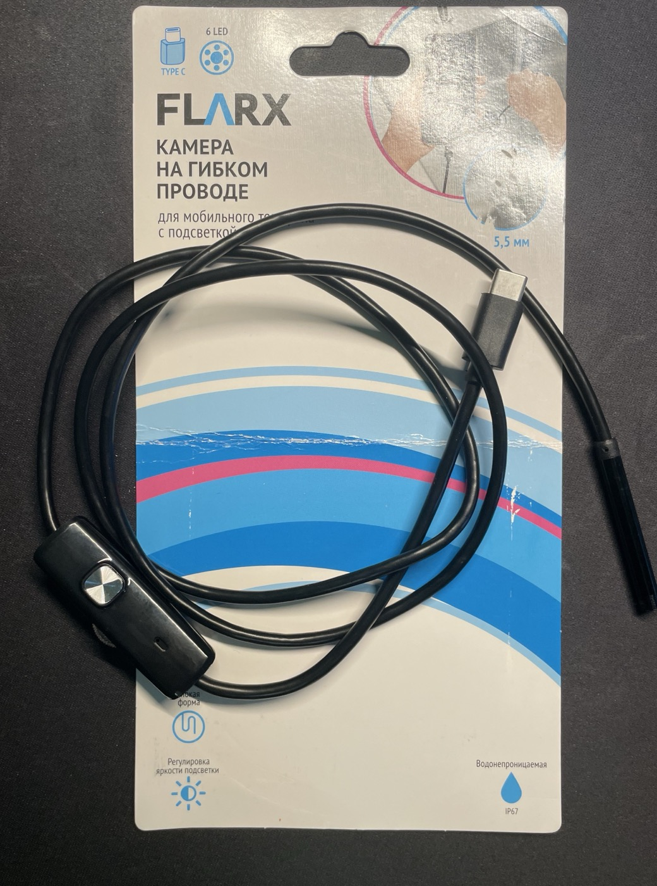
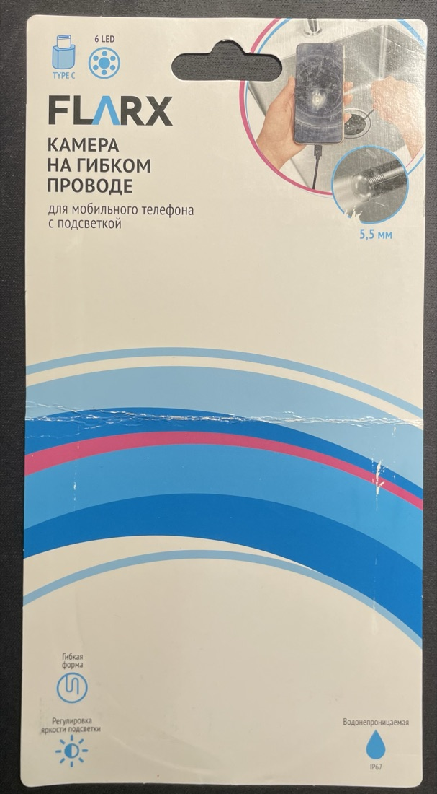
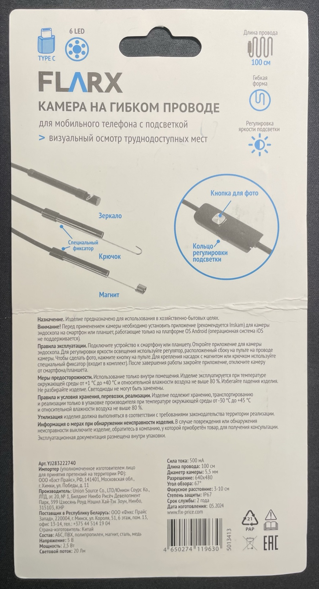

# FLARX «Камера на гибком проводе» из Fix Price — рабочее приложение для Android

Если вы купили в **Fix Price** эндоскоп **FLARX** с разъёмом **Type-C** и не можете найти приложение, которое его видит, — вы попали куда нужно.

**[Скачать APK](https://github.com/nitrobin/AndroidUSBCamera/releases/latest)** · открытый код · без рекламы · без доступа в интернет

---

## Почему обычные приложения показывают чёрный экран

Эта камера отдаёт **только несжатое видео (YUYV)**. Формата MJPEG у неё нет вообще.

Большинство приложений для эндоскопов рассчитаны на MJPEG. Подключаешь такую камеру — приложение её находит, но картинки нет: чёрный экран или вечное «подключение». Причина именно в формате, а не в кабеле и не в телефоне.

Приложение из этого репозитория работает с несжатым потоком, поэтому камера в нём открывается.

На упаковке рекомендовано приложение **Inskam**. Если оно у вас не заработало или вас смущает, что оно закрытое и просит доступ в сеть, — здесь открытая альтернатива.

---

## Как узнать свою камеру

| Признак | Значение |
|---|---|
| Бренд | FLARX |
| Название на упаковке | Камера на гибком проводе для мобильного телефона с подсветкой |
| Магазин | Fix Price |
| Артикул | **YJ283222740** |
| Штрихкод | **4650274119630** |
| Разъём | USB Type-C |
| Дата изготовления на упаковке | 05.2024 |

При подключении к компьютеру определяется как:

| | |
|---|---|
| Имя устройства | `HD camera` |
| Производитель | `Generic` |
| USB VID:PID | **`349c:0411`** |
| Серийный номер | `20201212000000` |

`349c` — код, не закреплённый ни за одной известной фирмой. Это безымянный модуль, поэтому по названию производителя камеру не найти. **Ищите по VID:PID `349c:0411`** — это самый надёжный признак.

---

## Характеристики

### С упаковки

| Параметр | Значение |
|---|---|
| Разрешение | 640×480 |
| Диаметр камеры | 5,5 мм |
| Угол обзора | 67° |
| Фокусное расстояние | 3–10 см |
| Длина провода | 100 см |
| Подсветка | 6 светодиодов, 20 Лм, регулировка яркости |
| Защита | IP67 |
| Питание | 5 В, 2,5 Вт, 500 мА |
| Форма | гибкая, держит изгиб |
| В комплекте | зеркало, крючок, магнит, фиксатор |
| Производитель | Union Source Co., LTD (Нинбо, КНР) |

### Измерено на деле

Проверено подключением к компьютеру (`macOS`, чтение дескрипторов USB и захват кадра).

| Параметр | Значение |
|---|---|
| Класс устройства | стандартный UVC — драйверы не нужны |
| Формат | **только YUYV, несжатый.** MJPEG нет |
| Разрешения | 176×144, 320×240, 352×288, 480×360, 640×360, **640×480** |
| Заявленная частота кадров | 30 и 5 к/с |
| Фактическая частота | около **17 к/с** на 640×480 |
| Размер кадра | 614 400 байт (640 × 480 × 2) |

**Про «HD» в названии устройства:** его там нет. Максимум — 640×480, это VGA.

**Про 30 кадров:** камера их заявляет, но несжатый поток 640×480 на 30 к/с — это почти 150 Мбит/с, потолок USB 2.0. На практике выходит около 17 к/с. Это нормально и не признак брака.

---

## Что нужно для работы

- **Телефон или планшет на Android** с поддержкой USB-хост (OTG). Почти все современные умеют.
- **Переходник OTG**, если у камеры Type-C, а у телефона microUSB — или наоборот. Если разъёмы совпадают, переходник не нужен.
- Android 4.4 или новее.

Приложение само находит камеру при подключении и сразу показывает картинку. Настраивать ничего не надо.

---

## Установка

1. Скачайте APK со [страницы релизов](https://github.com/nitrobin/AndroidUSBCamera/releases/latest).
2. Разрешите установку из этого источника, когда Android спросит.
3. Подключите камеру, дайте приложению доступ к USB-устройству.

Приложение **не запрашивает доступ в интернет** — из него вырезана отправка отчётов о сбоях, которая была в исходном проекте. Разрешения только на камеру, микрофон и сохранение снимков.

---

## Фотографии упаковки

Лицевая сторона:

Оборот со всеми характеристиками:

---

## Что проверено, а что нет

**Проверено:** характеристики камеры измерены напрямую, кадр с неё снят. Приложение собрано, ставится и запускается на Android 11.

**Не проверено:** связка «эта камера + это приложение на Android» вживую не испытывалась — камера снималась на компьютере, приложение проверялось на планшете отдельно. Совместимость следует из того, что приложение умеет несжатый YUYV, а камера стандартная UVC, но своими глазами картинку на телефоне с этой камеры мы не видели.

Если попробуете — напишите в [Issues](https://github.com/nitrobin/AndroidUSBCamera/issues), заработало или нет. Это поможет следующим покупателям.

---

English summary

**FLARX flexible cable camera (borescope / endoscope) sold at Fix Price stores, USB Type-C, article YJ283222740, barcode 4650274119630.**

Identified over USB as `HD camera`, **VID:PID `349c:0411`**, manufacturer `Generic`. Standard UVC device, no drivers needed.

**It only offers uncompressed YUYV — no MJPEG at all.** This is why many Android endoscope apps show a black screen with it. Max resolution 640×480 (despite the "HD camera" name), ~17 fps in practice because uncompressed VGA at 30 fps would need ~150 Mbit/s, near the USB 2.0 ceiling.

Specs: 5.5 mm head, 67° FOV, focus 3–10 cm, 100 cm cable, 6 LEDs with brightness control, IP67, 5 V / 2.5 W / 500 mA.

A working open-source Android app is available in [Releases](https://github.com/nitrobin/AndroidUSBCamera/releases/latest) — no ads, no network permission.

---

Приложение — форк [jiangdongguo/AndroidUSBCamera](https://github.com/jiangdongguo/AndroidUSBCamera), лицензия Apache-2.0.

Ключевые слова для поиска: FLARX, Fix Price, Фикс Прайс, эндоскоп, бороскоп, камера на гибком проводе, USB камера, Type-C, YJ283222740, 4650274119630, 349c:0411, приложение для эндоскопа Android, чёрный экран эндоскоп, endoscope app Android, borescope, UVC, YUYV.
